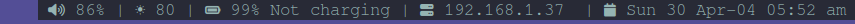
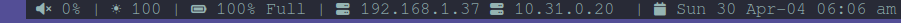

## Demo




## Description
A personal status bar for the DWM (Dynamic Windows Manager) software written by the [Suckless](https://dwm.suckless.org/) team. I tried not to overcrowd my status bar and display only the functions I often need.

**Information displayed in the status bar**
- Volume (function=dwm_volume_alsa, requirement=alsa-utils)
- Screen Brightness (function=dwm_brightness, requirement=xorg_xrandr)
- Battery volume and status (function=dwm_battery)
- private IP address (function=dwm_private_ip, requirement=nmcli)
- date and time (function=dwm_date_time)

I display the local IP address because I often connect to the provided vpn to solve CTF (Capture The Flag) events and I always forget my new private IP

## Referesh Rate
I decided to **refresh and recall the Volume and Screen Brightness functions every 1 second, but the other function will be updated every 60 seconds.**

```sh
battery=$(dwm_battery)
private_ip=$(dwm_private_ip)
date_time=$(dwm_date_time)

while true; do
    # Update volume and brightness every 1 second
    brightness=$(dwm_brightness)
    volume=$(dwm_volume_alsa)
    status_bar=" $volume $SEP "

    # Update other functions every 60 seconds
    if (( SECONDS % 60 == 0 )); then
        battery=$(dwm_battery)
        private_ip=$(dwm_private_ip)
        date_time=$(dwm_date_time)
    fi
    
    # Append all function outputs to status bar
    status_bar="$status_bar$brightness $SEP "
    status_bar="$status_bar$battery $SEP "
    status_bar="$status_bar$private_ip $SEP "
    status_bar="$status_bar$date_time "

    # Update the status bar
    xsetroot -name "$status_bar"

    # Wait for 1 second before repeating the loop
    sleep 1
done
```


## Installation
1. Clone the repository:

> git clone https://github.com/ramixix/StatusBar_Script_Dwm

2. Make sure you have installed all packages necessary for the functions to work properly. 

```txt
    Volume : **amixer** program which is part of **alsa-utils** package
    Screen Brightness : **xorg-xrandr**
    Private IP : **nmcli**
    To Use Emojis : ttf-font-awesome or noto-fonts-emoji
```

If you are using arch, you can run the following command to install all dependencies if you haven't already installed them:

> sudo pacman -S $(cat Requirements.txt)

3. Run the script setup_statusbar.sh

> ./setup_statusbar.sh


### Automate Start
If you want your bar to be displayed when X starts, you need to add a line to run setup_statusbar.sh inside the .xinitrc file just before starting dwm. For example, if the script is located in /home/$USER/opt/Statusbar_Script_Dwm:

```bash
    # Statusbar
    ./home/$USER/opt/StatusBar_Script_Dwm/setup_statusbar.sh &

    # Start dwm
    exec dwm
```

### Customizing
You can costume the bar as you like, add more functions or remove them. **If you want to remove a function, all you need to do is comment out the required parts where we call that function in the setup_statusbar.sh file.**

**You can also decide to use Emojis (used by default) or plain text identifiers for functions by changing $USE_EMOJIES to ture or false in setup_statusbar.sh**